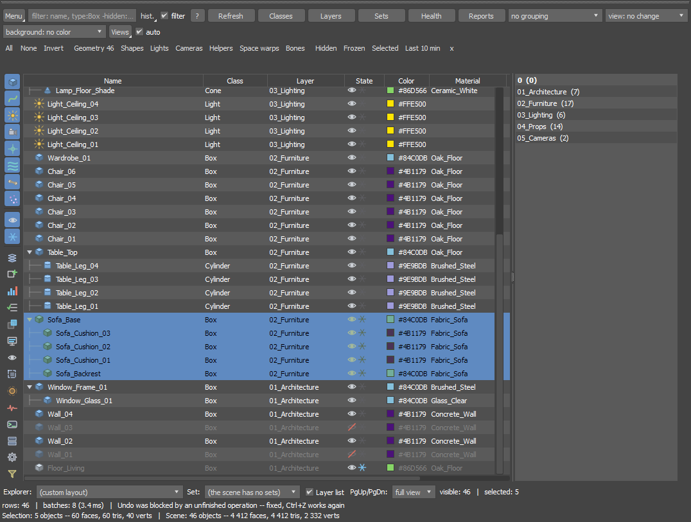
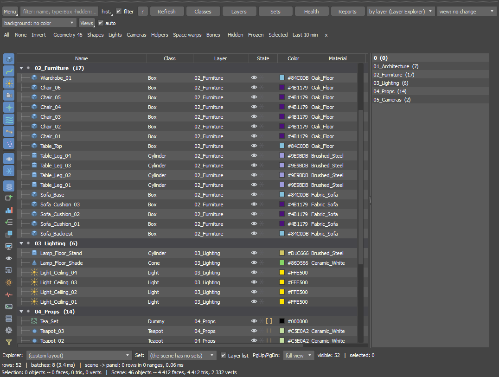
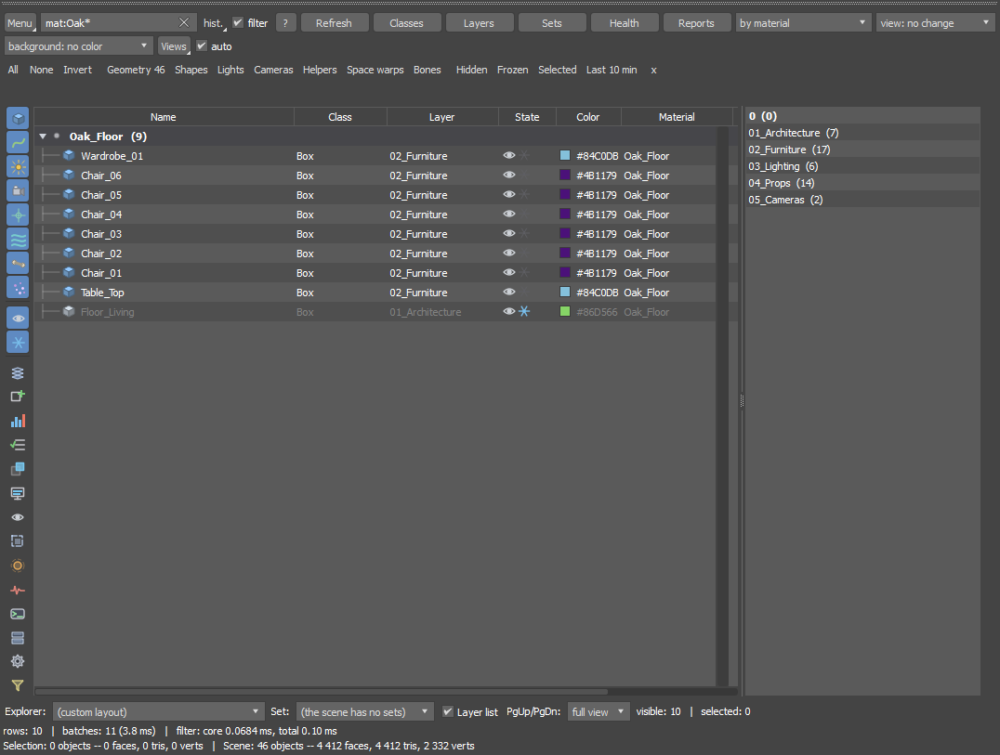

# SceneForge Outliner

**A scene outliner for Autodesk 3ds Max 2027 that does not freeze Max.**
Filter, sort, hide, freeze and select across tens of thousands of objects - the list
keeps up while you work.

SceneForge is a dockable panel that replaces day-to-day work in the Scene Explorer.
Its core is compiled .NET code that reads the whole scene in one pass (about 0.1 s
for 50 000 objects), so typing a filter, switching a lens or deleting a thousand
objects does not lock the viewport.

This repository holds the **documentation, release notes and the issue tracker**.
The plugin itself is sold separately; there is no source code here.

## Highlights

- **Fast on heavy scenes** - a snapshot of a 50 026-object scene in about 100 ms; the list
  refreshes by itself after add, delete, import, merge, undo and redo
- **Filter language** - `is:missingmat`, `is:instance`, `mat:wood*`, `map:*.hdr`, `tag:urgent`,
  query history and one-click category and state chips
- **Lenses** - one view instead of the Hierarchy and Layer explorers: the same scene grouped
  by layer, class, material, instance, group or face count; drag rows onto a material header
  to assign it
- **Columns** - faces, modifiers, instances, material, layer, age, tags and notes; plus
  footer counters for faces, triangles and vertices of the selection and of the scene
- **Scene reports** - geometry duplicates, scene weight, missing textures (with relinking),
  snapshot comparison, a timeline of changes and naming rules
- **Production tools** - batch and template renaming, Scene Doctor fixes, pivot tools,
  layer export, selection history (Alt+Left / Alt+Right), saved views, macros,
  create a camera from the viewport for Arnold, V-Ray, Corona or FStorm
- **Every scene edit is one Ctrl+Z** - hide, freeze, rename, material, layers, hierarchy
- Works on the whole selection: click an eye or a freeze icon on one selected row and every
  selected object follows; Ctrl+drag selects a range of rows
- No internet connection, no telemetry

| | |
|---|---|
|  |  |
| The **by layer** lens - the Layer Explorer inside the same list | `mat:Oak*` with the **by material** lens - the filter runs in 0.07 ms |

## Documentation

| Document | What it covers |
|---|---|
| [User Guide (PDF)](docs/SceneForge_User_Guide.pdf) | installation, first run, filter language, columns, lenses, shortcuts, scene reports, performance, troubleshooting |
| [User Guide (HTML)](docs/SceneForge_User_Guide.html) | the same guide - download it and open it in a browser; it is also installed with the plugin (**SceneForge > Documentation**) |

Release notes: [CHANGELOG.md](CHANGELOG.md) - the changes made after the guide was written
are listed there.

## Requirements

Autodesk 3ds Max 2027, Windows 10/11 64-bit. English user interface of 3ds Max.

## Installation

Drag `SceneForge.mzp` onto a 3ds Max viewport. The commands appear straight away in
**Customize > Customize User Interface**, category **SceneForge**; the **SceneForge** entry in
the main menu appears after 3ds Max is restarted.

## Reporting a bug or asking for a feature

Bugs and ideas can be reported **on GitHub or by e-mail** - both are read.

**[Open an issue](https://github.com/looki666/SceneForge/issues/new/choose)** and pick a form:

- **Bug report** - something does not work as described.
  In 3ds Max choose **SceneForge > Report a bug...** first: it copies your 3ds Max and
  SceneForge details (and the last lines of the panel log) to the clipboard, ready to paste
  into the form.
- **Feature request** - an idea for a new filter, column, report or command.
- **Question** - how do I...?

Prefer e-mail? Write to **forgeplugins@gmail.com** - the same address takes bug reports, feature
requests and support questions. Please do not post licence or purchase details in a
public issue; send those by e-mail.

## Author

More plugins by the author: **https://forgeplugins.tech**

SceneForge and its documentation are (c) the author, all rights reserved.
Autodesk and 3ds Max are registered trademarks of Autodesk, Inc. SceneForge is not
affiliated with or endorsed by Autodesk.
